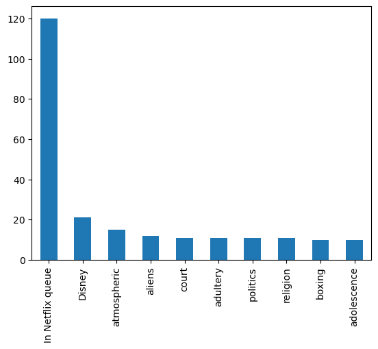

# Laporan Proyek Machine Learning - Hendratara Pratama

## Project Overview

**MovieLens** adalah situs penelitian yang dijalankan oleh GroupLens Research di University of Minnesota. **MovieLens** menggunakan teknologi "_collaborative filtering_" untuk membuat rekomendasi film yang mungkin disukai pengguna, dan untuk membantu menghindari film yang tidak disukai. Berdasarkan peringkat film Anda, MovieLens menghasilkan prediksi yang dipersonalisasi untuk film yang belum Anda tonton. MovieLens adalah kendaraan penelitian unik untuk puluhan mahasiswa sarjana dan pascasarjana yang meneliti berbagai aspek teknologi personalisasi dan penyaringan.[1]

Untuk setiap pengguna, **MovieLens** memprediksi bagaimana pengguna akan menilai film apa pun yang diberikan di situs web. Berdasarkan peringkat yang diprediksi ini, sistem merekomendasikan film yang kemungkinan besar akan dinilai tinggi oleh pengguna. Situs web menyarankan agar pengguna menilai film yang ditonton sepenuhnya sebanyak mungkin, sehingga rekomendasi yang diberikan akan lebih akurat, karena sistem kemudian akan memiliki sampel selera film pengguna yang lebih baik. Namun, pendekatan insentif peringkat **MovieLens** tidak selalu efektif, karena peneliti menemukan lebih dari 20% film yang terdaftar dalam sistem memiliki peringkat yang sangat sedikit sehingga algoritme pemberi rekomendasi tidak dapat membuat prediksi yang akurat tentang apakah pelanggan akan menyukainya atau tidak. Rekomendasi tentang film tidak boleh mengandung nilai pemasaran apa pun yang dapat menangani sejumlah besar peringkat film sebagai "seed dataset". [2]

Dalam projek ini, tujuan utama adalah menciptakan sistem rekomendasi film yang dapat membantu pengguna menemukan film-film yang sesuai dengan preferensi dan selera mereka. Sistem rekomendasi ini akan menggunakan berbagai teknik seperti Collaborative Filtering dan Content-Based Filtering untuk memberikan rekomendasi yang akurat dan personal kepada pengguna.

## Business Understanding

**MovieLens** adalah platform rekomendasi film yang populer yang menyediakan rekomendasi film berdasarkan preferensi dan riwayat penontonan pengguna. Pemahaman bisnis untuk **MovieLens** mencakup pemahaman terhadap tujuan dan kebutuhan pengguna, serta fokus pada pengalaman menonton film yang lebih personal dan memuaskan. **MovieLens** berusaha untuk meningkatkan interaksi dan keterlibatan pengguna dengan platform. Dengan memberikan rekomendasi yang akurat dan tepat, pengguna diharapkan akan lebih tertarik untuk terus menggunakan platform ini dan mengeksplorasi film-film baru yang relevan dengan minat mereka. Selain menyajikan rekomendasi film, **MovieLens** juga dapat memberikan fitur tambahan, seperti sistem rating dan ulasan, untuk meningkatkan partisipasi pengguna dalam memberikan masukan dan umpan balik terhadap film yang telah ditonton.

tujuan utama projek ini adalah menciptakan sistem rekomendasi film yang dapat membantu pengguna aktif menemukan film-film yang sesuai dengan preferensi dan selera mereka. Sistem rekomendasi ini akan menggunakan berbagai teknik seperti Collaborative Filtering dan Content-Based Filtering untuk memberikan rekomendasi yang akurat dan personal kepada pengguna.

### Problem Statements

Menjelaskan pernyataan masalah:
- Bagaimana cara membuat sistem rekomendasi pada data film yang efektif?
- metode apa yang paling unggul untuk menentukan sistem rekomendasi movielens? collaborative filtering atau vontent based filtering?

### Goals

Menjelaskan tujuan proyek yang menjawab pernyataan masalah:
- Menganalisis kriteria evaluasi yang tepat untuk mengukur kinerja kedua metode dan memastikan bahwa sistem rekomendasi dapat memberikan rekomendasi yang akurat
- Menganalisis dan membandingkan metode collaborative filtering dan content-based filtering untuk menentukan sistem rekomendasi yang paling unggul untuk dataset MovieLens.

### Solution statements
- Menerapkan pendekatan collaborative filtering yang didasarkan pada perilaku kolektif pengguna dengan metode KNN.
- Semenerapkan pendekatan content-based filtering dalam sistem rekomendasi untuk data film dengan cosine similarity.
- Menggunakan Metrik Precision untuk membandingkan kedua metode tersebut.

## Data Understanding
Kumpulan data ini (ml-latest-small) menjelaskan rating bintang 5 dan aktivitas penandaan teks bebas dari MovieLens , layanan rekomendasi film. Ini berisi 100836 peringkat dan 3683 aplikasi tag di 9742 film. Data ini dibuat oleh 610 pengguna antara 29 Maret 1996 dan 24 September 2018. Kumpulan data ini dihasilkan pada 26 September 2018.

Pengguna dipilih secara acak untuk dimasukkan. Semua pengguna yang dipilih telah menilai setidaknya 20 film. Tidak ada informasi demografis yang disertakan. Setiap pengguna diwakili oleh sebuah id, dan tidak ada informasi lain yang disediakan.

Data tersebut terdapat dalam file links.csv, movies.csv, ratings.csvdan tags.csv. Rincian lebih lanjut tentang isi dan penggunaan semua file berikut.

Ini adalah kumpulan data pengembangan. Dengan demikian, ini dapat berubah dari waktu ke waktu [3]

### File yang terdapat pada MovieLens dataset adalah sebagai berikut:
- tags.csv -> Semua peringkat terkandung dalam file ratings.csv. Setiap baris file ini setelah baris header mewakili satu peringkat dari satu film oleh satu pengguna, dan memiliki format berikut: userId,movieId,rating,timestamp.

- movies.csv -> Semua tag terkandung dalam file tags.csv. Setiap baris file ini setelah baris header mewakili satu tag yang diterapkan ke satu film oleh satu pengguna, dan memiliki format berikut: userId,movieId,tag,timestamp.

- ratings.csv -> Informasi film terkandung dalam file movies.csv. Setiap baris file ini setelah baris header mewakili satu film, dan memiliki format berikut: movieId,title,genres.

- tags.csv -> Pengidentifikasi yang dapat digunakan untuk menautkan ke sumber data film lainnya terdapat dalam file links.csv. Setiap baris file ini setelah baris header mewakili satu film, dan memiliki format berikut: movieId,imdbId,tmdbId.

### Variabel-variabel pada MovieLens dataset adalah sebagai berikut:
- userId -> ID pengguna yang telah dianonimkan | (int64)
- movieId -> movieId adalah pengidentifikasi untuk film yang digunakan oleh https://movielens.org. Misal film Toy Story memiliki link https://movielens.org/movies/1 | (int64)
- rating -> Peringkat dibuat dalam skala 5 bintang, dengan peningkatan setengah bintang (0,5 bintang - 5,0 bintang) | (float64)
- timestamp -> Stempel waktu mewakili detik sejak tengah malam Waktu Universal Terkoordinasi (UTC) tanggal 1 Januari 1970 | (int64)
- tag -> Metadata buatan dari pengguna tentang film | (object)
- title -> Judul film | (object)
- genres -> list genre pipe-separated | (object)
- imdbId -> imdbId adalah pengidentifikasi untuk film yang digunakan oleh http://www.imdb.com. Misalnya film Toy Story memiliki link http://www.imdb.com/title/tt0114709/ | (int64)
- tmdbId -> tmdbId adalah pengenal untuk film yang digunakan oleh https://www.themoviedb.org. Misal film Toy Story memiliki link https://www.themoviedb.org/movie/862 | (float64)

### Menampilan 5 Data Teratas

Tabel 1. Links Dataframe

| | movieId | imdbId | tmdbId |
|-|---------|--------|--------|
| 0 | 1 | 114709 | 862.0 |
| 1 | 2 | 113497 | 8844.0 |
| 2 | 3 | 113228 | 15602.0 |
| 3 | 4 | 114885 | 31357.0 |
| 4 | 5 | 113041 | 11862.0 |

pada tabel 1. terdapat 3 fitur `movieId` berupa bilangan bulat, `imdbId` berupa bilangan bulat, dan `tmdbId` berupa bilangan pecahan.

Tabel 2. Movies Dataframe

| | movieId | title | genres |
|-|---------|-------|--------|
| 0 | 1 | Toy Story (1995) | Adventure\|Animation\|Children\|Comedy\|Fantasy |
| 1 | 2 | Jumanji (1995) | Adventure\|Children\|Fantasy |
| 2 | 3 | Grumpier Old Men (1995) | Comedy\|Romance |
| 3 | 4 | Waiting to Exhale (1995) | Comedy\|Drama\|Romance |
| 4 | 5 | Father of the Bride Part II (1995) | Comedy |

pada tabel 2. terdapat 3 fitur `movieId` berupa bilangan bulat, `title` berupa teks dari judul film, dan `genres` berupa genre dari film tersebut.

Tabel 3. Ratings Dataframe

| | userId | movieId | rating | timestamp |
|-|--------|---------|--------|-----------|
| 0 | 1 | 1 | 4.0 | 964982703 |
| 1 | 1 | 3 | 4.0 | 964981247 |
| 2 | 1 | 6 | 4.0 | 964982224 |
| 3 | 1 | 47 | 5.0 | 964983815 |
| 4 | 1 | 50 | 5.0 | 964982931 |

pada tabel 3. terdapat 4 fitur `userId` berupa bilangan bulat, `movieId` berupa bilangan bulat, `rating` berupa bilangan pecahan dari rating film, dan `timestamp` berupa bilangan bulat waktu rating.

Tabel 4. Tags Dataframe

| | userId | movieId | tag | timestamp |
|-|--------|---------|--------|-----------|
| 0 | 2 | 60756 | funny | 1445714994 |
| 1 | 2 | 60756 | Highly quotable | 1445714996 |
| 2 | 2 | 60756 | will ferrell | 1445714992 |
| 3 | 2 | 89774 | Boxing story | 1445715207 |
| 4 | 2 | 89774 | MMA | 1445715200 |

pada tabel 4. terdapat 4 fitur `userId` berupa bilangan bulat, `movieId` berupa bilangan bulat, `tag` berupa tag atau kategori dari film, dan `timestamp` berupa bilangan bulat waktu _tagging_.

### Visualisasi Data

Gambar 7. Top 10 Tags terbanyak

pada gambar 7 terlihat bahwa tag `In Netflix queue` memiliki data paling banyak yaitu sekitar 120 data.

## Data Preparation
Persiapan data melakukan beberapa metode antara lain handling missing value, vectorization, dan merging data. Lebih jelasnya sebagai berikut:

- Missing Value: 
Penanganan missing value untuk content-based filtering, yaitu dengan mengisi semua missing value dengan `UnkNown` dan untuk missing value collaborative filtering akan dibuang karena data yg missing tergolong sedikit.

- TF-IDF: 
TF-IDF (Term Frequency-Inverse Document Frequency) adalah salah satu teknik yang digunakan dalam pemrosesan teks dan analisis teks untuk mengukur pentingnya suatu kata dalam sebuah dokumen atau kumpulan dokumen (corpus). Teknik ini berguna untuk menganalisis teks secara numerik dan mendapatkan representasi vektor dari teks.

- Merging Data: 
Menyatukan beberapa DataFrame untuk mendapatkan fitur lain seperti `tag`, dan `userId` berdasarkan fitur `movieId`.

## Modeling

Sebelum melakukan pengembangan model, dilakukan persiapan dataframe untuk menganalisis model dengan menggunakan algoritma `K-Nearest Neighbor (KNN)`, dan `Cosine Similarity`.

- Algoritma K-Nearest Neighbors (KNN): 
Algoritma KNN menggunakan kesamaan fitur untuk memprediksi nilai dari setiap data yang baru. KNN bekerja dengan cara membandingkan jarak satu sampel ke sampel pelatihan lain dan memilih sejumlah k tetangga terdekat (dengan k adalah sebuah angka positif). Pada algoritma K-Nearest Neighbor menggunakan parameter n-neighbors dengan nilai k = 5. Metode yang dipakai untuk mengukur jarak kedekatannya yaitu dengan euclidean. 
    
    Rumus Jarak Euclidean
    d = sqrt((x1 - x2)**2 + (y1 - y2)**2)

- Algoritma Cosine Similarity:
Cosine Similarity adalah sebuah metode untuk mengukur sejauh mana kesamaan antara dua vektor dalam ruang multidimensional. Metode ini banyak digunakan dalam pemrosesan teks dan sistem rekomendasi untuk membandingkan kesamaan antara dua teks atau dokumen.

### Hasil Rekomendasi
Hasil rekomendasi dari film `American President, The (1995)` pada tiap-tiap metode

Tabel 5. Rekomendasi dengan Content Based Filtering menggunakan Cosine Similarity

| | movie | tag |
|-|-------|-----|
| 0 | Fahrenheit 9/11 (2004) | politics |
| 1 | Nixon (1995) | politics |
| 2 | Weather Underground, The (2002) | politics |
| 3 | Legally Blonde 2: Red, White & Blonde (2003) | politics |
| 4 | Primary Colors (1998) | politics |
| 5 | Mr. Smith Goes to Washington (1939) | politics |
| 6 | War Room, The (1993) | politics |
| 7 | Candidate, The (1972) | politics |
| 8 | Bob Roberts (1992) | politics |
| 9 | Something Wild (1986) | Unknown |

pada tabel 5. terdapat 10 rekomendasi film dengan metode Cosine Similarity

Tabel 6. Rekomendasi dengan Collaborative Filtering menggunakan KNN

| | movieId | title | userId | rating | distance | tag | 
|-|---------|-------|--------|--------|----------|-----|
| 0 | 70334 | Sabrina (1995) | 6.0 | 4.0 | 0.0 | remake |
| 1 | 175303 | Tekkonkinkreet (Tekkon kinkurîto) | 306.0 | 4.0 | 0.0 | time travel |
| 2 | 161131 | Casino (1995) |6.0 | 4.0 | 0.0 | Mafia |
| 3 | 157296 | Babe (1995) | 6.0 | 4.0 | 0.0 | Animal movie |
| 4 | 4896 | American President, The (1995) | 6.0 | 4.0 | 0.0 | politics |
| 5 | 101962 | Santa Clause, The (1994) | 6.0 | 4.0 | 0.0 | Christmas |
| 6 | 162600 | Sense and Sensibility (1995) | 6.0 | 4.0 | 0.0 | Jane Austen |
| 7 | 3793 | Jumanji (1995) | 6.0 | 4.0 | 0.0 | fantasy |
| 8 | 5388 | Heat (1995) | 6.0 | 4.0 | 0.0 | UnkNown |
| 9 | 189111 | Little Women (1994) | 6.0 | 4.0 | 0.0 | Louisa May Alcott |

pada tabel 6. terdapat 10 rekomendasi film dengan metode KNN

## Evaluation
Pada tahap evaluasi, dilakukan pengujian model dengan kedua algoritma yang telah dibuat pada tahap modeling. Teknik evaluasi yang digunakan yaitu precision. Precision akan dihitung untuk kedua model (KNN dan Cosine Similarity).

Evaluasi precision adalah salah satu metrik evaluasi yang digunakan untuk mengukur sejauh mana model atau sistem dapat memberikan rekomendasi yang relevan dan tepat kepada pengguna. Precision menghitung proporsi item yang relevan (dalam hal ini, item yang benar-benar disukai atau dipilih oleh pengguna) dari keseluruhan item yang direkomendasikan oleh sistem.

    Precision = relevant / jumlah_top-n * 100
    
`relevant` adalah data yang relevan sesuai dengan preferensi pengguna
`jumlah-_top-n` adalah top-n rekomendasi berdasarkan tiap-tiap metode.

Cara kerja metrik precision yaitu dengan membagi nilai item yang relevan dengan nilai jumlah item dengan Fitur yang relevan pada hasil KNN adalah 1 dan Cosine Similarity adalah 9 dengan jumlah total top-N adalah 10. apabila dimasukkan kedalam rumus maka akan menjadi seperti berikut : 
- presisi KNN = 1 / 10, yaitu 0.1 atau 10%
- Presisi Cosine Similarity = 9 / 10, yaitu 0.9 atau 90%

Kelebihan dari metriks ini berfokus pada bagaimana performa (prediksi) model terhadap label data positif, kekurangannya metriks ini tidak memperhitungkan label negatifnya,untuk rumus sendiri.
    
untuk proses evaluasi movie input yaitu: `American President, The (1995)`

setelah dilakukan evaluasi precision, diketahui bahwa:
- Cosine Similarity memiliki presisi `0.9` atau 90%
- KNN memiliki presisi `0.1` atau 10%

## Kesimpulan
Dari hasil evaluasi, ditemukan bahwa model Cosine Similarity memberikan performa yang lebih baik dalam melakukan rekomendasi berdasarkan kesamaan preferensi pengguna berdasarkan film serupa. Model Cosine Similarity memiliki tingkat presisi yang lebih tinggi dan lebih konsisten dalam memberikan rekomendasi yang relevan dengan preferensi pengguna.

## Saran 
Untuk mendapatkan rekomendasi yang lebih bai disarankan memakai full data dari MovieLens yang berukuran 250M.

## Referensi
[1] MovieLens: [MovieLens](https://movielens.org/info/about)
[2] Wikipedia: [Wikipedia](https://en.m.wikipedia.org/wiki/MovieLens)
[3] MovieLens Dataset: [MovieLens Dataset](https://grouplens.org/datasets/movielens/)