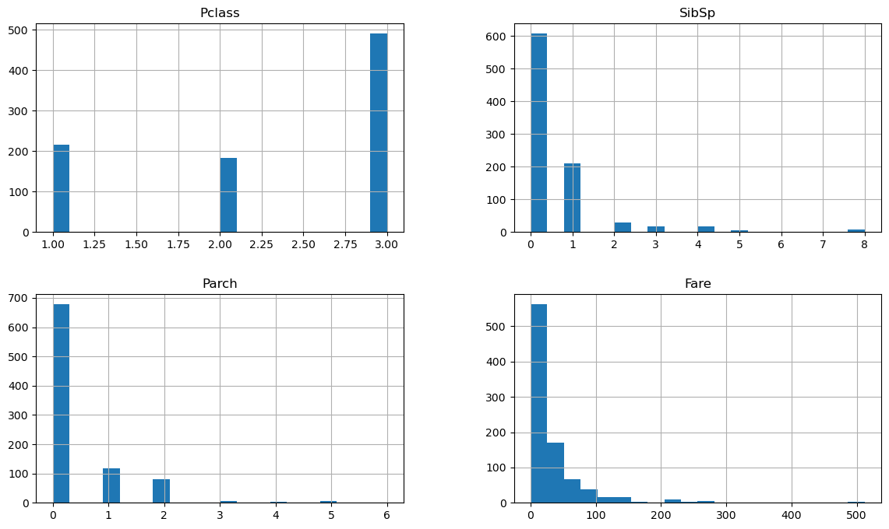
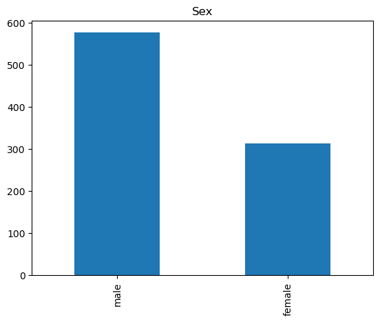
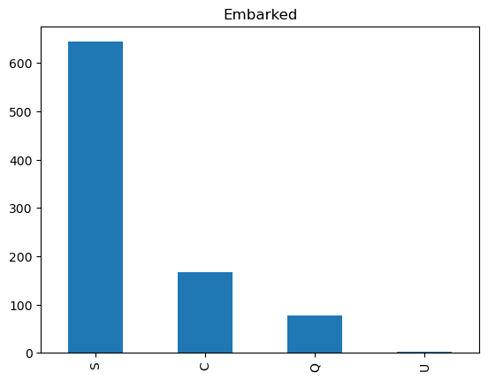
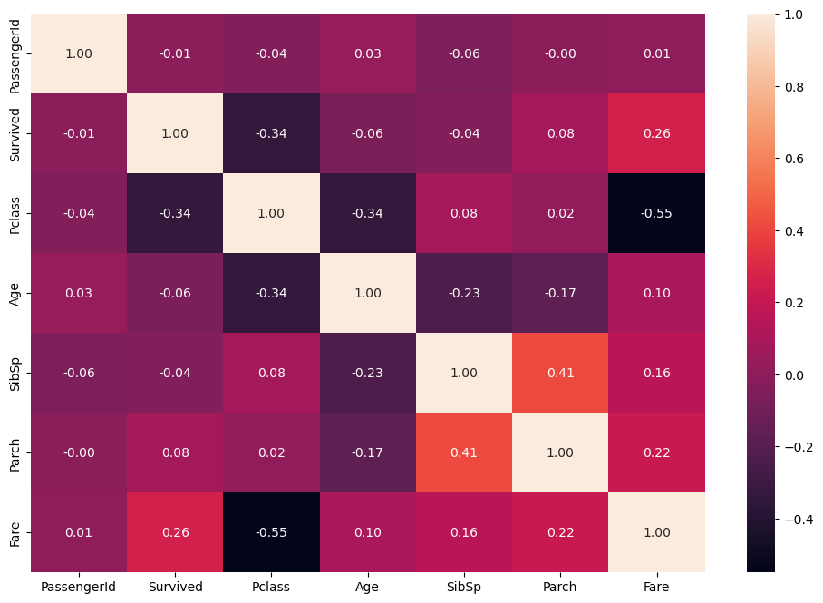
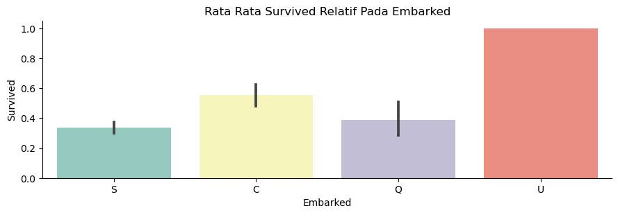
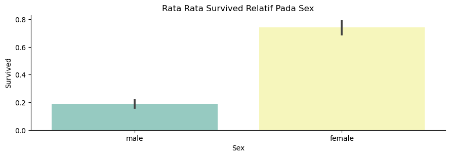
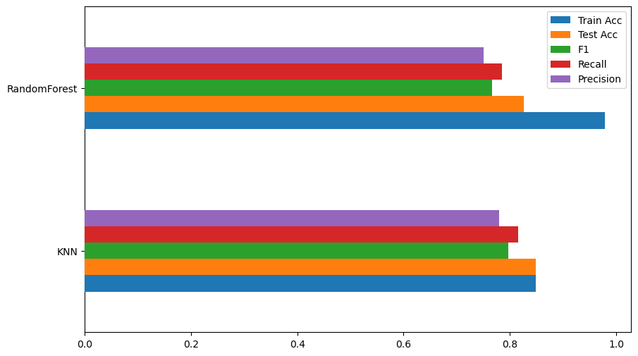

# Laporan Proyek Machine Learning - Hendratara Pratama

## Domain Proyek

**RMS Titanic** adalah sebuah kapal penumpang super Britania Raya yang tenggelam di Samudra Atlantik Utara pada tanggal 15 April 1912 setelah menabrak sebuah gunung es pada pelayaran perdananya dari Southampton, Inggris ke New York City. Tenggelamnya **Titanic** mengakibatkan kematian sebanyak 1514 orang dalam salah satu bencana maritim masa paling mematikan sepanjang sejarah. **Titanic** merupakan kapal terbesar di dunia pada pelayaran perdananya. Satu dari tiga kapal samudra kelas Olympic dioperasikan oleh _White Star Line_. Kapal ini dibangun pada 1909 sampai 1911 oleh galangan kapal _Harland_ and _Wolff_ di _Belfast_. Kapal ini sanggup mengangkut 2,224 penumpang. [Wikipedia](https://id.wikipedia.org/wiki/RMS_Titanic). Dalam proyek ini diharapkan dapat untuk membuat model _machine learning_ untuk memprediksi kriteria orang yang seperti apa yang mungkin untuk bertahan hidup jika ada kasus kapal tenggelam seperti titanic ini.

## Business Understanding

Tenggelamnya Titanic adalah salah satu bangkai kapal paling terkenal dalam sejarah.

Pada tanggal 15 April 1912, selama pelayaran perdananya, RMS Titanic yang secara luas dianggap “tidak dapat tenggelam” tenggelam setelah bertabrakan dengan gunung es. Sayangnya, tidak ada sekoci yang cukup untuk semua orang di dalamnya, mengakibatkan kematian 1502 dari 2224 penumpang dan awak.

Meskipun ada unsur keberuntungan yang terlibat dalam bertahan hidup, tampaknya beberapa kelompok orang lebih mungkin bertahan hidup daripada yang lain.

### Problem Statements

Menjelaskan pernyataan masalah latar belakang:
- Seberapa baik model dapat mengklasifikasikan penumpang ke dalam kelompok yang benar, yaitu bertahan hidup.

### Goals

Menjelaskan tujuan dari pernyataan masalah:
- Membuat Model ML yang dapat memprediksi kebertahanan hidup seseorang dari kejadian seperti kapal titanic.

### Solution statements
- Menggunakan klasifikasi dari 2 metode baseline, yaitu: KNN, dan RandomForest dan menentukan model mana yang paling handal.
- Setelah menentukan diantara 2 metode tersebut, lalu dilakukan hyperparameter tuning dengan GridSearchCV agar mendapatkan parameter yang optimal

## Data Understanding
Dataset yang digunakan bersifat publik [Titanic - Machine Learning from disaster](https://www.kaggle.com/c/titanic/data).

### Variabel-variabel pada Restaurant UCI dataset adalah sebagai berikut:
- PassengerId | Id Penumpang
- Survived -> status bertahan hidup (0 = Tidak, 1 = Ya)
- Pclass -> Kelas Tiket (1 = pertama, 2 = kedua, 3 = ketiga)
- Name -> Nama Penumpang
- Sex -> jenis kelamin / gender
- Age -> umur dalam tahun
- Sibsp -> Jumlah pasangan / saudara di dalam kapal
- Parch -> jumlah orangtua / anak di dalam kapal
- Ticket -> nomor tiket
- Fare -> Tarif penumpang
- Cabin -> Nomor Kabin
- Embarked -> pelabuhan awal naik (C = Cherbourg, Q = Queenstown, S = Southampton)

Nama Dataset yang digunakan yaitu `Titanic - Machine Learning Disaster`. Dataset ini berisi 891 data penumpang kapal titanic dan status kebertahanan hidupnya setelah tenggelamnya kapa titanic.

Dalam dataset tersebut terdapat 7 numerikal fitur yaitu: `PassengerId`, `Survived`, `Pclass`, `Age`, `Sibsp`, `Parch`, dan `Fare` lalu ada 5 kategorikal fitur yaitu: `Name`, `Sex`, `Ticket`, `Cabin`, dan `Embarked`.

### Tipe Tipe Data pada Atribut

tabel 1. Tipe data dan atribut

| # | Fitur | Dtype |
|---|-------|-------|
| 0 | Survived | int64 |
| 1 | Pclass | int64 |
| 2 | Name | Object |
| 3 | Sex | Object |
| 4 | Age | float64 |
| 5 | SibSp | int64 |
| 6 | Parch | int64 |
| 7 | Ticket | Object |
| 8 | Fare | float64 |
| 9 | Cabin | Object |
| 10 | Embarked | Object |
| 11 | PassengerId | int64 |

Dapat dilihat pada tabel 1. bahwa pada dataset yang digunakan terdapat tiga tipe data, yaitu int64,object, dan float64

### Analisis Deskriptif

- * Analisa pada data numerik *

tabel 2. Analisis Deskriptif pada tipe data numerik

| Param | PassengerId | Survived | Pclass | Age | SibSp | Parch | Fare |
|-------|-------------|----------|--------|-----|-------|-------|------|
| count | 891.000000 | 891.000000 | 891.000000 | 891.000000 | 891.000000 | 891.000000 | 891.000000 |
| mean | 446.000000 | 0.383838 | 2.308642 | 29.699118 | 0.523008 | 0.381594 | 32.204208 |
| std | 257.353842 | 0.486592 | 0.836071 | 14.526497 | 1.102743 | 0.806057 | 49.693429 |
| min | 1.000000 | 0.000000 | 1.000000 | 0.420000 | 0.000000 | 0.000000 | 0.000000 |
| 25% | 223.500000 | 0.000000 | 2.000000 | 20.125000 | 0.000000 | 0.000000 | 7.910400 |
| 50% | 446.000000 | 0.000000 | 3.000000 | 28.000000 | 0.000000 | 0.000000 | 14.454200 |
| 75% | 668.500000 | 1.000000 | 3.000000 | 38.000000 | 1.000000 | 0.000000 | 31.000000 |
| max | 891.000000 | 1.000000 | 3.000000 | 80.000000 | 8.000000 | 6.000000 | 512.329200 |

pada tabel 2. dapat disimpulkan data adalah sebagai berikut:
- PClass pada rentang 1 - 3 dengan rata-rata 2.308642
- Usia pada rentang 0 - 80 tahun dengan rata-rata 29.699118
- SibSP pada rentang 0 - 8 tahun dengan rata-rata 0.523008
- Parch pada rentang 0 - 6 tahun dengan rata-rata 0.381594
- Fare pada rentang 0 - 512.329200 tahun dengan rata-rata 32.204208

* analisa pada data kategorik *

gambar 1. grafik histogram dari numerical feature

Terlihat pada gambar 1. bahwa data distribusi ada yang distribusi nilainya ada yang rata (zero-skewed). Hal ini akan berimplikasi pada model nantinya

- * Menangani Missing Value *
Terdapat missing value, maka kategorikal value akan diubah menjadi `U` untuk unknown dan nilai median untuk numerikal value.

gambar 2. Grafik Bar `Sex`

Pada gambar 2. dapat dilihat bahwa data menunjukan laki-laki lebih banyak dibanding perempuan

gambar 3. Grafik Bar `Embarked`

Pada gambar 3. sebagian besar penumpang berangkat pada Southampton

- * Multivariate Analysis *

gambar 4. Grafik Korelasi Heatmap

Pada gambar 4. korelasi Survived dapat disimpulkan sebagai berikut:

| Params | Value |
|--------|-------|
| PassengerId | -0.01 |
| Survived | 1.00 |
| Pclass | -0.34 |
| Age | -0.06 |
| SibSp | -0.04 |
| Parch | 0.08 |
| Fare | 0.26 |

- Fitur yang berkaitan dengan label adalah dengan value < -0.25 dan > 0.25
- Fitur yang memiliki korelasi positif dengan pengaruh besar : Fare
- Fitur yang memiliki korelasi negatif dengan pengaruh besar : Pclass
- Fitur yang sangat kecil sekali memiliki korelasi: PassengerId, Age, SibSp, Parch
- Sedangkan yang lainnya adalah fitur yang kecil pengaruhnya terhadap CVD

Gambar 5. Grafik Catplot Embarked

Pada gambar 5. selain yang tidak diketahui, rata rata survived berasal dari Cherbourg

Gambar 6. Grafik Catplot Sex

Pada gambar 6. perempuan lebih cenderung survive daripada laki laki

## Data Preparation

Beberapa proses yang dilakukan yakni, mapping kategorikal menjadi numerikal, pembagian data latih dan data uji, dan standarisasi data.

- * Mapping Data *
Mengubah kategorikal data menjadi numerikal pada fitur `Sex`, dan `Embarked`. Dimana pada fitur `Sex`, male = 0, dan female = 1. Pada fitur embarked, S = 1, C = 2, Q = 3, dan U = 4.

- * Train Test Split *
Perbandingan data latih dan data uji pada dataset, yakni 80 : 20. Jadi, total sampel data latih sebanyak 712 data dan total sampel data uji sebanyak 179 data.

- * Standarisasi *
Proses standarisasi fitur numerik, yaitu `Fear` menggunakan StandardScaler sehingga fitur data menjadi bentuk yang lebih mudah diolah oleh model machine learning. Standarisasi membantu menghilangkan perbedaan skala antara fitur-fitur dalam dataset. Perbedaan skala yang signifikan dapat mempengaruhi hasil model, terutama pada algoritma yang sensitif terhadap perbedaan skala. Dengan standarisasi, semua fitur memiliki rentang yang serupa, sehingga memungkinkan algoritma untuk memberikan bobot yang adil pada setiap fitur.

- * One Hot Encoding *
Proses One Hot Encoding dalam proyek ini memakai `pd.get_dummies()` dan atribut yang dilakukan encoding yaitu `Sex` dan `Emabrked`.

## Modeling

Sebelum melakukan pengembangan model, dilakukan persiapan dataframe untuk menganalisis model dengan menggunakan algoritma `K-Nearest Neighbor (KNN)`, dan `Random Forest`.

- * Algoritma K-Nearest Neighbors (KNN) *

Algoritma KNN menggunakan kesamaan fitur untuk memprediksi nilai dari setiap data yang baru. KNN bekerja dengan cara membandingkan jarak satu sampel ke sampel pelatihan lain dan memilih sejumlah k tetangga terdekat (dengan k adalah sebuah angka positif). Pada algoritma K-Nearest Neighbor menggunakan parameter n-neighbors dengan nilai k = 5.

    knn = KNeighborsRegressor(n_neighbors=5)
    
    - Kelebihan: Algoritma KNN merupakan algoritma yang sederhana dan mudah untuk diimplementasikan misalnya pada beberapa kasus klasifikasi, regresi dan pencarian

    - Kekurangan: Algoritma KNN menjadi lebih lambat secara signifikan seiring meningkatnya jumlah sampel dan/atau variabel independen.

- * Algoritma Random Forest *

Algoritma Random Forest merupakan salah satu algoritma supervised learning yang digunakan untuk menyelesaikan masalah klasifikasi dan regresi. Random forest merupakan salah satu model machine learning yang termasuk ke dalam kategori ensemble (group) learning. Pada algoritma Random Forest menggunakan base parameter n-estimator dengan jumlah 100 trees (pohon).

    rf = RandomForestRegressor()

    - Kelebihan : Algoritma Random Forest merupakan algoritma dengan pembelajaran paling akurat yang tersedia. Untuk banyak kumpulan data, algoritma ini menghasilkan pengklasifikasi yang sangat akurat, berjalan secara efisien pada data besar, dapat menangani ribuan variabel input tanpa penghapusan variabel, memberikan perkiraan variabel apa yang penting dalam klasifikasi, dan memiliki metode yang efektif untuk memperkirakan data yang hilang dan menjaga akurasi ketika sebagian besar data hilang.
    - Kekurangan : Algoritma Random Forest overfiting untuk beberapa kumpulan data dengan tugas klasifikasi/regresi yang bising/noise. Selain itu, untuk data yang menyertakan variabel kategorik dengan jumlah level yang berbeda, Random Forest menjadi bias dalam mendukung atribut dengan level yang lebih banyak. Oleh karena itu, skor kepentingan variabel dari Random Forest tidak dapat diandalkan untuk jenis data ini.
    
berikut adalah hasil dari baseline model:

| Algoritma | Train Acc | Test Acc | F1 | Recall | Precision |
|-----------|-----------|----------|----|--------|-----------|
| KNN | 0.848315 | 0.849162 | 0.796992 | 0.815385 | 0.779412 |
| RF | 0.978933 | 0.826816 | 0.766917 | 0.784615 | 0.75 |

Gambar 7. Hasil Evaluasi Base Model KNN dan Random Forest

  
pada gambar 7. dapat dilihat bahwa:
- KNN Unggul pada Test Accuracy, F1-Score, Recall, dan Precision
- KNN lebih stabil daripada Random Forest
- Random Forest mengalami ovefitting pada Test Accuracy

Dari baseline diatas akan digunakan Metode KNN untuk dilakukan hyperparameter tuning karena KNN lebih unggul daripada Random Forest.
    
### Hyper Parameter Tuning Metode Random Forest

Model KNN dapat menjadi solusi karena memberikan metrics yang paling mendekati dengan data sebenarnya jika dibandingkan dengan algoritma Random Forest. Maka selanjutnya akan dilakukan pencarian parameter terbaik dengan GridSearchCV. GridSearchCV adalah metode yang digunakan dalam pemodelan mesin untuk menemukan kombinasi optimal dari hyperparameter model yang memberikan performa terbaik. Hyperparameter adalah parameter yang tidak ditentukan oleh model itu sendiri, tetapi harus ditentukan oleh pengguna atau pemodel.
    
lalu didapatkan parameter terbaik untuk algoritma KNN yaitu: n_neighbors sebanyak 6

## Evaluation

Pada tahap evaluasi, dilakukan pengujian model dengan kedua algoritma yang telah dibuat pada tahap modeling. Sebelum melakukan evaluasi, dilakukan proses scaling pada fitur-fitur numerik pada data uji sehingga skala antara data latih dan data uji sama.

    x_test[feat] = scaler.transform(x_test[feat].values)
    
Berikut hasil evaluasi base model menggunakan metriks precission, recall, f1-score, dan accuracy pada random forest:

| Preds | Precision | Recall | F1-Score | Support |
|-------|-----------|--------|----------|---------|
| 0 | 0.87 | 0.84 | 0.86 | 114 |
| 1 | 0.74 | 0.78 | 0.76 | 65 |
| accuracy |  |  | 0.82 | 179 |
| macro avg | 0.81 | 0.81 | 0.81 | 179 |
| weighted avg | 0.82 | 0.82 | 0.82 | 179 |

Dari tabel diatas, diketahui bahwa random forest memiliki accuracy sebesar 82%.
    
Berikut adalah hasil prediksi dengan KNN dari 179 baris data:

       [1, 0, 0, 0, 0, 0, 1, 1, 0, 1, 0, 0, 1, 0, 1, 1, 1, 0, 0, 0, 1, 1,
       0, 0, 0, 0, 0, 1, 0, 0, 0, 1, 0, 0, 0, 1, 0, 0, 0, 0, 1, 0, 0, 0,
       0, 0, 1, 1, 0, 1, 1, 0, 0, 0, 0, 0, 0, 0, 0, 0, 1, 1, 1, 1, 0, 0,
       0, 0, 1, 1, 1, 0, 1, 0, 0, 0, 0, 0, 1, 1, 1, 0, 0, 0, 0, 0, 1, 0,
       1, 0, 0, 0, 0, 0, 0, 0, 1, 1, 0, 1, 0, 0, 1, 1, 0, 1, 0, 0, 0, 1,
       1, 0, 1, 1, 0, 0, 0, 0, 0, 1, 0, 0, 1, 0, 0, 0, 0, 0, 1, 0, 1, 0,
       0, 1, 1, 0, 1, 1, 0, 1, 0, 0, 0, 1, 1, 0, 0, 1, 0, 1, 1, 0, 1, 0,
       1, 0, 1, 1, 0, 1, 0, 0, 1, 1, 0, 1, 1, 0, 1, 0, 0, 1, 0, 0, 0, 0,
       1, 0, 0]

Metrik evaluasi yang digunakan yaitu precission, recall, f1-score, dan accuracy pada metode KNN, yaitu:

| Preds | Precision | Recall | F1-Score | Support |
|-------|-----------|--------|----------|---------|
| 0 | 0.84 | 0.92 | 0.88 | 114 |
| 1 | 0.83 | 0.69 | 0.76 | 65 |
| accuracy |  |  | 0.84 | 179 |
| macro avg | 0.84 | 0.81 | 0.82 | 179 |
| weighted avg | 0.84 | 0.84 | 0.83 | 179 |

Pada tabel diatas diketahui bahwa Kesimpulan yang diperoleh dari hasil analisis dan pemodelan _machine learning_ untuk kasus ini, yaitu:

- Metode KNN memiliki accuracy lebih tinggi dibandingkan metode Random Forest
- Metode KNN memiliki kemungkinan sekitar 83% hasil prediksi dapat mengklasifikasikan penumpang ke dalam kelompok yang benar, yaitu bertahan hidup atau tidak bertahan hidup.
- Model KNN memberikan metrics yang paling tinggi dibandingkan dengan Random Forest
- Model KNN menjadi solusi untuk memprediksi orang yang mungkin untuk bertahan hidup jika ada kejadian kapal tenggelam seperti titanic dengan tingkat akurasi yang tergolong tinggi karena menghasilkan tingkat accuracy, f1-score, precision, dan recall yang sudah baik.
